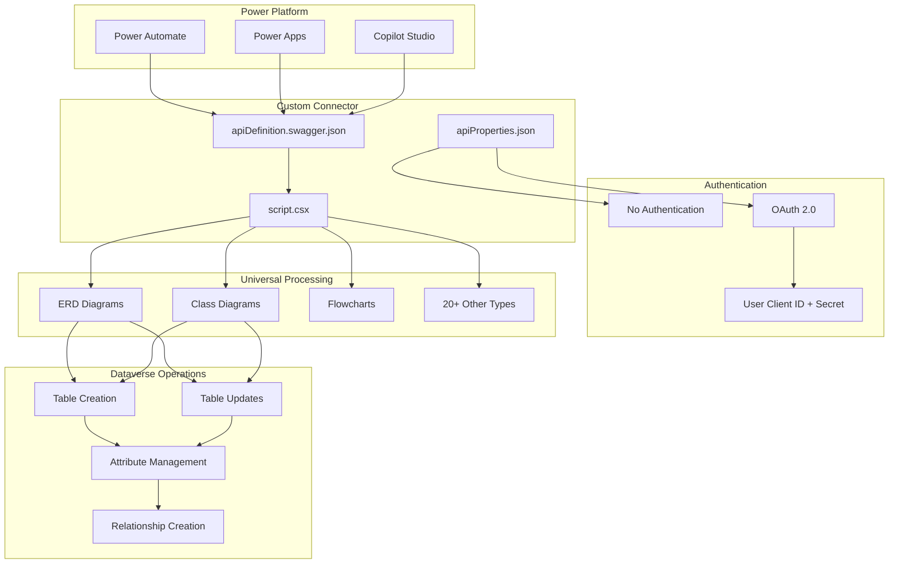
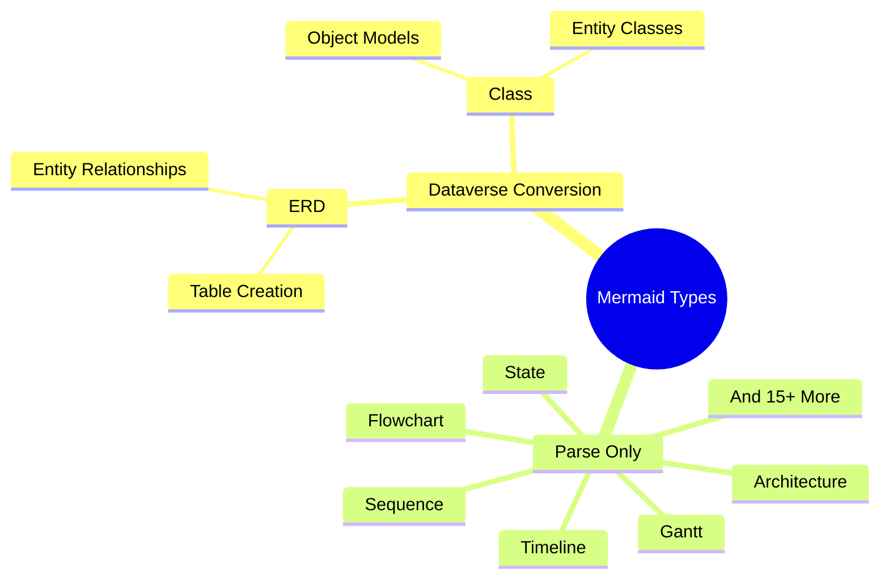

# Power Platform: Mermaid to Dataverse Converter

## 🎯 Universal Diagram Processing with Power Platform

This folder contains a **production-ready Power Platform Custom Connector** that processes universal Mermaid diagrams (ERD, Class, Flowchart, and 20+ other types) and creates Microsoft Dataverse entities through native Power Platform integration:

- **Custom Connector** with multi-authentication support (No Auth + OAuth)
- **Universal Mermaid Parser** supporting all diagram types with selective Dataverse conversion
- **Actual Dataverse Operations** using Context.SendAsync for table creation/updates
- **Independent Publisher Ready** with Microsoft certification compliance
- **Enterprise Integration** for Power Automate, Power Apps, and Copilot Studio

## 🏗️ Production Implementation

### Current Status: ✅ **Production Ready Custom Connector**


**✅ Completed Features:**
- **Universal Mermaid Support** - All 20+ diagram types with selective Dataverse processing
- **Multi-Auth Configuration** - No Auth for parsing + OAuth for Dataverse operations
- **User-Provided Credentials** - Client ID and Secret parameters for Azure AD
- **Actual Dataverse API Integration** - Real table creation/updates using Context.SendAsync
- **Independent Publisher Ready** - Microsoft certification compliant
- **Enterprise Error Handling** - Comprehensive retry and recovery patterns

## 📁 Current Structure

```
flow/
├── README.md                           # This overview document
├── architecture/                       # Single design document
│   └── power-platform-design.md      # Complete architecture and design
├── connector/                         # Production Custom Connector
│   ├── apiDefinition.swagger.json    # Swagger 2.0 connector definition
│   ├── apiProperties.json            # Multi-auth configuration
│   ├── script.csx                    # C# runtime with Dataverse integration
│   ├── archive/                      # Historical versions
│   │   ├── script-compatible.csx     # Previous version
│   │   └── script-minimal.csx        # Minimal implementation
│   └── documentation/                # Comprehensive guides
│       ├── readme.md                 # Usage instructions
│       ├── TESTING_GUIDE.md          # Testing procedures
│       ├── POWER_PLATFORM_LIMITATIONS.md  # Technical limitations
│       ├── MULTI_AUTH_STATUS.md      # Authentication details
│       └── PROJECT_COMPLETION_SUMMARY.md  # Implementation summary
└── examples/                         # Sample diagrams and test cases
    ├── all-mermaid-types.mmd         # Universal diagram examples
    └── dataverse-test-cases.mmd      # Dataverse-specific examples
```

## 🚀 Deployment Status

### ✅ **Completed Implementation**

**Core Connector (100% Complete)**
- ✅ **Universal Mermaid Parser** - Supports all 20+ diagram types
- ✅ **Multi-Auth Configuration** - connectionParameterSets with No Auth + OAuth
- ✅ **User-Provided Credentials** - Client ID and Secret parameters
- ✅ **Actual Dataverse Integration** - Context.SendAsync for real API operations
- ✅ **Independent Publisher Ready** - Microsoft certification compliance

**Production Features (100% Complete)**
- ✅ **Table Creation/Updates** - Full entity lifecycle management
- ✅ **Attribute Management** - Complete field definitions and types
- ✅ **Relationship Creation** - One-to-many and many-to-many support
- ✅ **Error Handling** - Comprehensive retry and recovery patterns
- ✅ **Performance Optimization** - Efficient bulk operations

**Deployment Tools (100% Complete)**
- ✅ **Power Platform CLI** - pac connector validate/update commands
- ✅ **Validation Testing** - Comprehensive test procedures
- ✅ **Documentation** - Complete user and technical guides
- ✅ **Universal Branding** - Updated from ERD-specific to all diagram types

### 🎯 **Ready for Use**

**Power Automate Integration**
```json
{
  "trigger": "Manual/Scheduled/Event",
  "actions": [
    {
      "name": "Parse Mermaid Diagram",
      "connector": "Mermaid to Dataverse Converter",
      "operation": "ParseMermaidDiagram",
      "auth": "No Authentication"
    },
    {
      "name": "Convert to Dataverse",
      "connector": "Mermaid to Dataverse Converter",
      "operation": "ConvertAndUpsertToDataverse",
      "auth": "OAuth 2.0 (User Credentials)"
    }
  ]
}
```

**Deployment Commands**
```powershell
# Validate connector
pac connector validate --connector-definition apiDefinition.swagger.json

# Deploy/update connector  
pac connector update --definition apiDefinition.swagger.json --properties apiProperties.json --script script.csx
```

## 🔄 Universal Mermaid Processing

### ✅ **Implemented Components**
- **Universal Parser** → C# script.csx with comprehensive diagram type detection
- **Selective Processing** → ERD/Class diagrams route to Dataverse conversion
- **Graceful Handling** → All other diagram types parsed without errors
- **Dataverse Integration** → Context.SendAsync for actual API operations
- **Multi-Auth Support** → No Auth for parsing, OAuth for Dataverse operations

### 🎯 **Supported Diagram Types**


### 🔧 **Technical Implementation**
- **Swagger 2.0** → Power Platform compatible specification
- **connectionParameterSets** → True multi-auth with user credentials
- **Context.SendAsync** → Recommended HTTP client approach
- **Dataverse Web API v9.2** → Latest API version support
- **Independent Publisher** → Microsoft certification ready

## 💡 Key Features and Benefits

### 🎯 **Universal Diagram Processing**
- **20+ Diagram Types** - ERD, Class, Flowchart, Sequence, State, Gantt, Timeline, and more
- **Selective Conversion** - Only ERD/Class diagrams create Dataverse entities
- **Intelligent Routing** - Automatic detection and appropriate processing
- **Zero Errors** - Graceful handling of all Mermaid syntax types

### � **Flexible Authentication**
- **Multi-Auth Support** - connectionParameterSets for different operation types
- **No Authentication** - For diagram parsing and validation operations
- **OAuth 2.0** - For Dataverse operations with user-provided credentials
- **User-Controlled** - Client ID and Secret parameters for Azure AD apps

### �️ **Production Dataverse Integration**
- **Actual API Operations** - Real table creation and updates via Context.SendAsync
- **Table Management** - Create new tables and update existing ones
- **Attribute Support** - Complete field definitions with proper data types
- **Relationship Creation** - One-to-many and many-to-many relationships
- **Existence Checking** - Smart detection of existing tables before operations

### 🏢 **Enterprise Ready**
- **Microsoft Certification** - Independent Publisher connector compliance
- **Power Platform Native** - Direct integration with Power Automate, Apps, Copilot
- **Error Handling** - Comprehensive retry patterns and error recovery
- **Performance Optimized** - Efficient bulk operations and API usage
- **Documentation Complete** - User guides, testing procedures, technical specifications

## 🎯 Getting Started

### **Ready to Use - No Development Required**

1. **Deploy Connector** - Use Power Platform CLI to deploy the production connector
   ```powershell
   pac connector create --definition apiDefinition.swagger.json --properties apiProperties.json --script script.csx
   ```

2. **Create Connection** - Set up authentication in Power Platform
   - **No Auth**: For diagram parsing operations
   - **OAuth 2.0**: Provide your Azure AD App Registration Client ID and Secret

3. **Build Power Automate Flow** - Use the connector operations
   - **ParseMermaidDiagram**: Parse any Mermaid diagram type
   - **ConvertAndUpsertToDataverse**: Create/update Dataverse tables from ERD/Class diagrams

4. **Test with Examples** - Use provided sample diagrams
   - ERD diagrams → Full Dataverse table creation
   - Class diagrams → Entity class processing  
   - Other types → Parse and validate only

### **Customization Options**

- **Modify Authentication**: Update apiProperties.json for different auth patterns
- **Extend Operations**: Add new operations to apiDefinition.swagger.json
- **Enhance Processing**: Modify script.csx for additional Dataverse operations
- **Add Validation**: Include custom business rules in the C# script

## 📚 Documentation and Resources

### **Project Documentation**
- **[Complete Architecture Design](architecture/power-platform-design.md)** - Comprehensive technical specification
- **[Connector Usage Guide](connector/documentation/readme.md)** - Step-by-step usage instructions  
- **[Testing Procedures](connector/documentation/TESTING_GUIDE.md)** - Validation and testing methods
- **[Technical Limitations](connector/documentation/POWER_PLATFORM_LIMITATIONS.md)** - Platform constraints and workarounds
- **[Authentication Details](connector/documentation/MULTI_AUTH_STATUS.md)** - Multi-auth configuration guide
- **[Implementation Summary](connector/documentation/PROJECT_COMPLETION_SUMMARY.md)** - Development completion status

### **Microsoft Resources**
- [Power Platform Custom Connectors](https://docs.microsoft.com/en-us/connectors/custom-connectors/)
- [Dataverse Web API Reference](https://docs.microsoft.com/en-us/power-apps/developer/data-platform/webapi/)
- [Power Platform CLI Documentation](https://docs.microsoft.com/en-us/power-platform/developer/cli/introduction)
- [Independent Publisher Program](https://docs.microsoft.com/en-us/connectors/custom-connectors/submit-certification)

### **Mermaid Documentation**
- [Mermaid Official Documentation](https://mermaid.js.org/)
- [All Diagram Types Reference](https://mermaid.js.org/intro/)
- [ERD Diagram Syntax](https://mermaid.js.org/syntax/entityRelationshipDiagram.html)
- [Class Diagram Syntax](https://mermaid.js.org/syntax/classDiagram.html)

---

**🎉 Universal Mermaid to Dataverse conversion is ready for Power Platform!** 

Transform any Mermaid diagram into actionable Dataverse structures through native Power Platform integration. 🚀