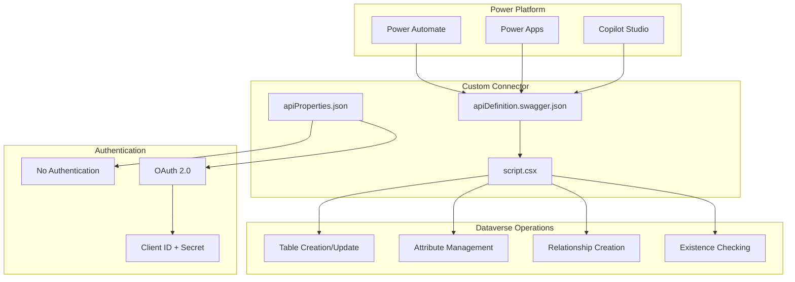
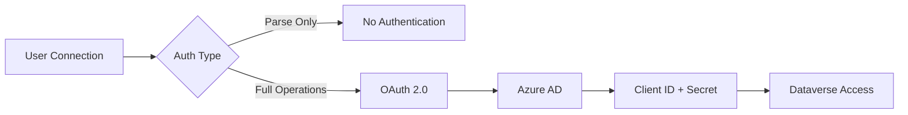
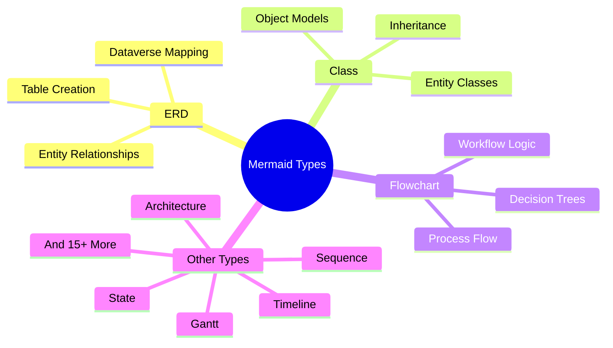
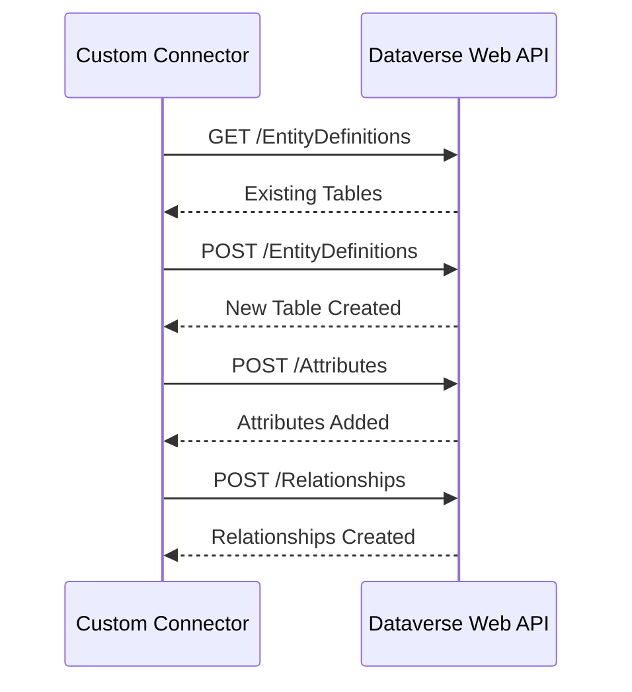

# Power Platform Design: Mermaid to Dataverse Converter

## 🎯 Solution Overview

A **Power Platform Custom Connector** that processes universal Mermaid diagrams (ERD, Class, Flowchart, and 20+ other types) and creates Microsoft Dataverse entities through automated workflows. The solution provides native Power Platform integration with multi-authentication support and comprehensive Dataverse API operations.

## 🏗️ Architecture



## 🔧 Components

### 1. apiDefinition.swagger.json
**Purpose**: Swagger 2.0 specification defining connector operations
- **ParseMermaidDiagram**: No authentication, universal diagram parsing
- **ConvertAndUpsertToDataverse**: OAuth authentication, Dataverse operations
- **Universal Support**: Handles ERD, Class, Flowchart, Sequence, State, Gantt, Pie, Journey, Quadrant, XY Chart, Mindmap, Timeline, Sankey, Block, GitGraph, C4, Requirements, Architecture, Radar, Treemap, Kanban, Packet diagrams

### 2. apiProperties.json
**Purpose**: Multi-authentication configuration with user-provided credentials
```json
{
  "connectionParameterSets": {
    "uiDefinition": {
      "displayName": "Authentication Type",
      "description": "Select authentication method"
    },
    "values": [
      {
        "name": "noauth",
        "uiDefinition": {
          "displayName": "No Authentication",
          "description": "Use for diagram parsing only"
        }
      },
      {
        "name": "oauth",
        "uiDefinition": {
          "displayName": "OAuth 2.0",
          "description": "Required for Dataverse operations"
        },
        "parameters": {
          "clientId": {
            "type": "string",
            "uiDefinition": {
              "displayName": "Client ID",
              "description": "Azure AD App Registration Client ID"
            }
          },
          "clientSecret": {
            "type": "securestring",
            "uiDefinition": {
              "displayName": "Client Secret",
              "description": "Azure AD App Registration Client Secret"
            }
          }
        }
      }
    ]
  }
}
```

### 3. script.csx
**Purpose**: C# runtime logic with actual Dataverse API integration
- **Universal Parser**: Detects and processes all Mermaid diagram types
- **Dataverse Operations**: Uses Context.SendAsync for HTTP calls
- **Table Management**: Creation, update, and existence checking
- **Relationship Handling**: One-to-many, many-to-many relationship creation
- **Error Handling**: Comprehensive error tracking and recovery

## 🔐 Authentication Architecture

### Multi-Auth Configuration


### Authentication Flows
1. **No Authentication**: For diagram parsing operations only
2. **OAuth 2.0**: For full Dataverse operations
   - User provides Azure AD App Registration credentials
   - Scope: `https://service.powerapps.com//.default`
   - Authorization Code flow with PKCE

## 📊 Universal Mermaid Support

### Supported Diagram Types


### Processing Logic
1. **Universal Detection**: Identifies diagram type from syntax
2. **Selective Processing**: Routes ERD/Class to Dataverse conversion
3. **Graceful Handling**: Parses all types without errors
4. **Metadata Return**: Provides structure analysis for all types

## 🛠️ Dataverse Integration

### API Operations


### Implementation Details
- **HTTP Client**: Context.SendAsync method (recommended approach)
- **API Version**: Dataverse Web API v9.2
- **Operations**: Create, Update, Read entity definitions
- **Error Handling**: Retry logic with exponential backoff
- **Performance**: Bulk operations where possible

## 🔄 Power Platform Integration

### Power Automate Usage
```json
{
  "flowPattern": {
    "trigger": "Manual/Scheduled/Event",
    "actions": [
      {
        "name": "Parse Mermaid Diagram",
        "connector": "Mermaid Converter",
        "operation": "ParseMermaidDiagram",
        "authentication": "No Auth"
      },
      {
        "name": "Convert to Dataverse",
        "connector": "Mermaid Converter", 
        "operation": "ConvertAndUpsertToDataverse",
        "authentication": "OAuth 2.0"
      }
    ]
  }
}
```

### Power Apps Integration
- **Canvas Apps**: Direct connector usage for custom applications
- **Model-Driven Apps**: Integration with custom forms and views
- **Power Pages**: Web portal integration for external users

### Copilot Studio Integration
- **Custom Actions**: Mermaid processing as bot actions
- **Topic Integration**: Conversational diagram creation
- **Knowledge Base**: Diagram-driven knowledge management

## 📈 Performance & Scalability

### Connector Limits
- **Timeout**: 2 minutes per operation
- **Concurrency**: Power Platform managed
- **Throttling**: Respects Dataverse API limits
- **Retry Logic**: Built-in exponential backoff

### Optimization Strategies
- **Bulk Operations**: Multiple entities per request
- **Caching**: Reuse entity definitions
- **Parallel Processing**: Independent operations
- **Error Recovery**: Graceful failure handling

## 🚀 Deployment

### Independent Publisher Requirements
- ✅ **Open Source**: MIT license compliance
- ✅ **Documentation**: Comprehensive guides
- ✅ **Testing**: Validation procedures
- ✅ **Branding**: Universal Mermaid support
- ✅ **Authentication**: User-provided credentials
- ✅ **Certification**: Microsoft compliance

### Deployment Commands
```powershell
# Validate connector
pac connector validate --connector-definition apiDefinition.swagger.json

# Deploy connector
pac connector create --definition apiDefinition.swagger.json --properties apiProperties.json --script script.csx

# Update connector
pac connector update --definition apiDefinition.swagger.json --properties apiProperties.json --script script.csx
```

## 🧪 Testing

### Test Scenarios
1. **Universal Parsing**: All 20+ Mermaid diagram types
2. **Authentication**: Both No Auth and OAuth flows
3. **Dataverse Operations**: Table creation, updates, relationships
4. **Error Handling**: Invalid diagrams, authentication failures
5. **Performance**: Large diagrams, bulk operations

### Validation Tools
- **Power Platform CLI**: pac connector validate
- **Postman**: API endpoint testing
- **Power Automate**: Flow execution testing
- **Dataverse**: Entity verification

## 📚 Key Features

### ✅ Completed Capabilities
- **Universal Mermaid Parser**: Supports all diagram types
- **Multi-Auth Support**: No Auth + OAuth with user credentials
- **Actual Dataverse Operations**: Full CRUD operations via Context.SendAsync
- **Independent Publisher Ready**: Microsoft certification compliant
- **Comprehensive Error Handling**: Robust error management
- **Performance Optimized**: Efficient API usage patterns

### 🎯 Core Value Proposition
Transform any Mermaid diagram into actionable Dataverse structures through native Power Platform integration, supporting both simple parsing and full enterprise data modeling with user-controlled authentication and comprehensive API operations.

This design provides a **production-ready, enterprise-grade** Power Platform Custom Connector that seamlessly integrates universal Mermaid diagram processing with Microsoft Dataverse through native Power Platform workflows.