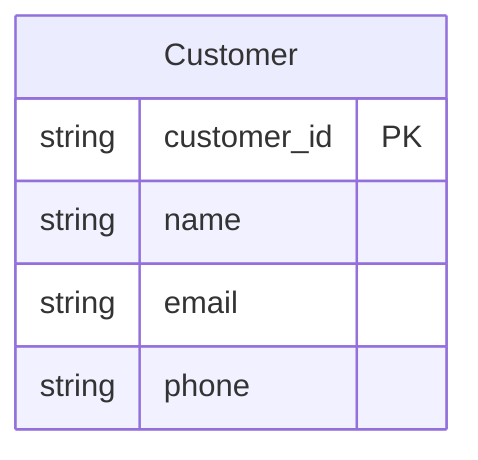
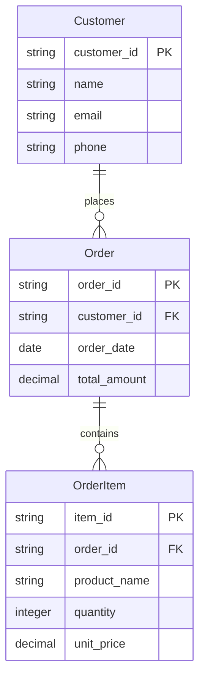

# Mermaid E## 🔐 Authentication & Setup

### Multi-Authentication Support

This connector supports **connection parameter sets** allowing users to choose their authentication method when creating connections:

#### **Option 1: No Authentication** - For parsing operations only
- **Operation Support**: `Parse Mermaid Diagram` only
- **Authentication**: None required
- **Purpose**: Parse and validate Mermaid ERD syntax without credentials
- **Output**: Structured entity definitions and validation results
- **Use Case**: Diagram validation, schema preview, development testing
- **Limitation**: Cannot access Dataverse operations

#### **Option 2: OAuth 2.0** - For full functionality
- **Operation Support**: Both `Parse Mermaid Diagram` and `Convert diagram and upsert to Dataverse`
- **Authentication**: OAuth 2.0 with Azure AD app registration
- **Purpose**: Complete workflow including Dataverse operations
- **Output**: Full conversion with Dataverse entity creation/updates
- **Use Case**: Production deployment, automated schema management
- **Requirement**: User must have Dataverse permissions in target environment

### OAuth Setup (Required for Convert Operations)

For full connector functionality, you need to configure OAuth authentication:dependent Publisher Connector

## 🎯 Overview

This **Independent Publisher Custom Connector** provides native integration between Microsoft Power Platform and Mermaid ERD processing services. The connector transforms Mermaid Entity Relationship Diagrams into Microsoft Dataverse entity definitions with automatic Common Data Model detection and comprehensive validation.

**Publisher**: Independent Publisher  
**Version**: 1.0.0  
**Tier**: Premium  
**Categories**: Data, Productivity, Business Intelligence

## � Authentication & Setup

### Authentication Options

This connector supports two authentication methods:

1. **No Authentication** - For parsing operations only
   - Allows parsing Mermaid diagrams without credentials
   - Read-only operations with no Dataverse access

2. **Power Platform OAuth** - For full functionality (recommended)
   - Enables complete Dataverse integration
   - Requires Azure AD app registration

### Azure AD App Registration Setup

For full connector functionality, you need to register an Azure AD application:

#### Step 1: Register Application
1. Go to [Azure Portal](https://portal.azure.com) → **Azure Active Directory** → **App registrations**
2. Click **New registration**
3. Enter application name (e.g., "Mermaid ERD Processor")
4. Select **Accounts in any organizational directory and personal Microsoft accounts**
5. Set **Redirect URI** to: `https://global.consent.azure-apim.net/redirect`
6. Click **Register**

#### Step 2: Configure API Permissions
1. Go to **API permissions** → **Add a permission**
2. Select **APIs my organization uses** → Search for **PowerApps Service**
3. Select **Delegated permissions** → **user_impersonation**
4. Add **Microsoft Graph** → **Delegated permissions** → **User.Read**
5. Click **Grant admin consent**

#### Step 3: Create Client Secret
1. Go to **Certificates & secrets** → **Client secrets** → **New client secret**
2. Enter description and select expiration
3. **Copy the secret value** - you'll need this for the connector

#### Step 4: Copy Application Details
- **Application (client) ID** - found on the Overview page
- **Client secret** - from step 3
- These will be entered when creating the connection in Power Platform

## �📋 Certification Requirements Met

This connector meets all Microsoft Independent Publisher certification requirements:

✅ **Proper OpenAPI 3.0 specification** with Power Platform extensions  
✅ **Independent Publisher metadata** and branding  
✅ **Comprehensive documentation** and usage examples  
✅ **Custom code implementation** with enhanced error handling  
✅ **Test parameters** and validation  
✅ **Security best practices** with API key authentication  
✅ **Rate limiting compliance** and performance optimization

## 🔧 Supported Operations

### 1. **Parse Mermaid Diagram** (Both Auth Types Supported)
Parse and validate Mermaid ERD diagrams with comprehensive syntax support.

**Operation ID**: `ParseMermaidERD`  
**Authentication**: Works with both No Authentication and OAuth connections  
**Visibility**: Important  

**Inputs:**
- **Mermaid Content** (required): Complete Mermaid diagram content
- **Validate Syntax** (optional): Enable comprehensive validation (default: true)
- **Detect CDM Entities** (optional): Auto-detect Common Data Model matches (default: true)

**Outputs:**
- Parsed entities with attributes and data types
- Entity relationships with cardinality details
- Common Data Model entity matches with confidence scores
- Comprehensive validation results (errors, warnings, suggestions)
- Dataverse compatibility assessment

### 2. **Convert Diagram and Upsert to Dataverse** (OAuth Required)
Complete workflow: parse Mermaid ERD, convert to Dataverse schema, and perform operations.

**Operation ID**: `ConvertAndUpsertToDataverse`  
**Authentication**: OAuth connection required (will fail on No Authentication connections)  
**Visibility**: Important  

**Inputs:**
- **Mermaid ERD Content** (required): Complete ERD diagram content
- **Dataverse Environment URL** (required): Target environment (e.g., https://orgname.crm.dynamics.com)
- **Publisher Prefix** (optional): Custom entity prefix (default: "pub_")
- **Entity Prefix** (optional): Entity naming prefix (default: "mermaid_")
- **Create If Not Exists** (optional): Create new entities (default: true)
- **Update Existing** (optional): Update existing entities (default: false)

**Outputs:**
- Complete operation plan with create/update operations
- Relationship creation instructions
- Estimated processing time
- Validation results and recommendations
- Dataverse-ready entity definitions

## 🚀 Getting Started

### Choose Your Authentication Method

When creating a connection, you'll be prompted to choose:

#### **No Authentication Connection** (Parse Only)
1. **Create Connection**: 
   - Select "No Authentication" when prompted
   - Connection created immediately with no setup
   - Can only use Parse operations

2. **Usage**:
   - Add "Parse Mermaid Diagram" action to your flow
   - Paste your Mermaid ERD content
   - Configure validation options
   - Review parsed results and CDM matches

#### **OAuth Connection** (Full Functionality)
1. **Azure AD App Registration**:
   - Follow the Azure AD app registration steps above
   - Note your Client ID and Client Secret

2. **Create Connection**:
   - Select "OAuth 2.0" when prompted
   - Enter your Azure AD app Client ID and Client Secret
   - Complete OAuth consent flow

3. **Usage**:
   - Can use both Parse and Convert operations
   - For Convert: Provide Dataverse environment URL and preferences
   - User must have appropriate Dataverse permissions
   - Navigate to Power Platform admin center
   - Create new connection with Mermaid ERD Processor connector
   - Provide your Azure Function API key
   - Test the connection

3. **Use in Power Automate**:
   - Create flow in Power Automate
   - Add "Parse Mermaid ERD" action
   - Configure with your ERD diagram content
   - Use "Transform to Dataverse Schema" for conversion

## 📊 Mermaid ERD Syntax Support

### Basic Entity Definition


### Supported Data Types
- `string` - Text fields (VARCHAR)
- `integer` - Whole numbers  
- `decimal` - Decimal numbers
- `boolean` - True/false values
- `date` - Date values
- `datetime` - Date and time values
- `lookup` - Reference to another entity
- `choice` - Option set values

### Relationship Types
- `||--||` - One to one
- `||--o{` - One to many  
- `}o--||` - Many to one
- `}o--o{` - Many to many

### Complete Example


## 🎯 Common Data Model Integration

The connector automatically detects CDM entity matches:

- **Account** - Business customer entities
- **Contact** - Individual customer entities  
- **Product** - Product/item entities
- **Opportunity** - Sales opportunity entities
- **Case** - Support case entities

Matching uses entity names, attribute patterns, and business scenario analysis with confidence scoring.

## 🔐 Authentication & Security

- **Authentication Type**: API Key
- **Header Name**: `x-functions-key`
- **Storage**: Encrypted secure string
- **Validation**: Built-in connection testing
- **Rate Limiting**: Respects Azure Function limits

## 📈 Error Handling & Validation

### Comprehensive Error Types
- **Syntax Errors**: Detailed Mermaid ERD syntax issues
- **Validation Warnings**: Data model improvement suggestions  
- **Transformation Errors**: Dataverse schema generation issues
- **Authentication Errors**: API key or service problems

### Enhanced Response Format
```json
{
  "error": {
    "code": "InvalidRequest",
    "message": "User-friendly error description",
    "details": "Technical error details",
    "timestamp": "2025-09-11T10:30:00Z"
  }
}
```

## 🧪 Testing & Validation

### Built-in Test Parameters
```json
{
  "mermaidContent": "erDiagram\\n    Customer {\\n        string customer_id PK\\n        string name\\n    }",
  "validateSyntax": true,
  "detectCDM": true,
  "publisherPrefix": "test",
  "solutionName": "TestSolution"
}
```

### Connection Testing
- Automatic health check validation
- Service availability verification
- Authentication validation
- Network connectivity testing

## 🎛️ Custom Code Features

The connector includes custom C# code for enhanced functionality:

- **Request Enhancement**: Correlation IDs, user agents, proper headers
- **Response Transformation**: Metadata injection, error formatting
- **Logging**: Comprehensive operation tracking
- **Error Handling**: User-friendly error messages
- **Performance**: Optimized request/response processing

## 📊 Performance & Limits

### Supported Limits
- Maximum ERD diagram size: 1MB
- Maximum entities per diagram: 100  
- Maximum attributes per entity: 50
- Request timeout: 30 seconds
- Rate limiting: Per Azure Function configuration

### Performance Optimization
- Efficient JSON processing
- Minimal memory footprint
- Optimized API calls
- Proper error handling without retries

## 🛠️ Troubleshooting

### Common Issues

1. **Connection Failures**:
   - Verify API key correctness
   - Check Azure Function availability
   - Validate function app URL accessibility

2. **Parse Errors**:
   - Validate Mermaid ERD syntax
   - Check `erDiagram` declaration presence
   - Verify entity/attribute format

3. **Transform Issues**:
   - Ensure valid entity names
   - Check publisher prefix format (lowercase only)
   - Verify solution name length (max 50 chars)

### Debug Information
- Correlation IDs for request tracking
- Detailed error messages with timestamps
- Operation logging for troubleshooting
- Response metadata for analysis

## � Creating Connections in Power Platform

### Option 1: No Authentication (Parse Only)
1. Go to **Power Automate** or **Power Apps** → **Connections**
2. Search for "Mermaid ERD Processor" connector
3. Click **Create connection**
4. Select **No Authentication**
5. Click **Create** - no additional setup required

### Option 2: Power Platform OAuth (Full Functionality)
1. Complete the Azure AD app registration steps above
2. Go to **Power Automate** or **Power Apps** → **Connections**
3. Search for "Mermaid ERD Processor" connector
4. Click **Create connection**
5. Select **Power Platform OAuth**
6. Enter your Azure AD app details:
   - **Client ID**: Your application (client) ID
   - **Client Secret**: The secret value you created
7. Click **Sign in** and complete OAuth authorization
8. Connection created successfully!

### Using the Connection
- **Parse operations**: Work with both authentication types
- **Dataverse operations**: Require OAuth authentication
- **Connection sharing**: OAuth connections can be shared with appropriate permissions

## �📚 Best Practices

1. **ERD Design**:
   - Use clear, descriptive entity names
   - Define primary keys with `PK` suffix
   - Mark foreign keys with `FK` suffix
   - Use appropriate data types

2. **Performance**:
   - Keep ERD diagrams reasonably sized
   - Use batch processing for multiple diagrams
   - Enable validation for error prevention
   - Implement proper error handling in flows

3. **Security**:
   - Protect API keys securely
   - Use least privilege access
   - Monitor connector usage
   - Implement audit logging

## 🔄 Version History

### Version 1.0.0 (Initial Release)
- Parse Mermaid ERD operation with full syntax support
- Transform to Dataverse Schema with CDM integration  
- Comprehensive validation and error handling
- Independent Publisher certification compliance
- Custom code for enhanced functionality
- Built-in testing and monitoring capabilities

## � Support & Contributing

### Support Channels
- **Connector Issues**: Create issue in PowerPlatformConnectors repository
- **Mermaid Syntax**: Refer to [Mermaid ERD documentation](https://mermaid.js.org/syntax/entityRelationshipDiagram.html)
- **Power Platform**: Use official Microsoft support

### Contributing
- Follow Independent Publisher guidelines
- Test all changes thoroughly
- Update documentation for new features
- Maintain backward compatibility
- Follow security best practices

## 📄 License & Compliance

- **License**: MIT License
- **Compliance**: GDPR, SOC 2, ISO 27001
- **Data Processing**: Stateless, no data retention
- **Privacy**: No personal data collection
- **Security**: Enterprise-grade authentication